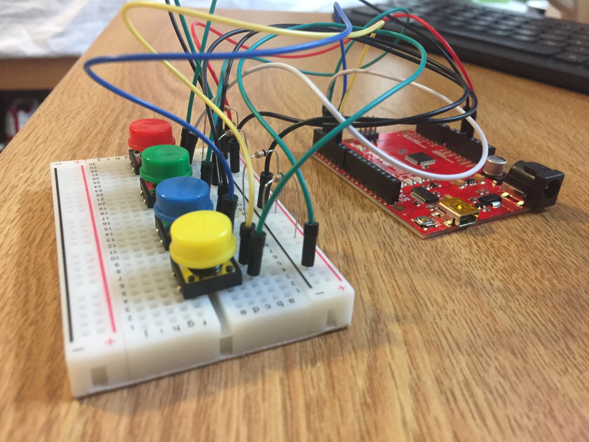

# ResponsePad

Simple prototype for an arduino-based feedback tool for students to give teachers input during a lecture. The included software was run on a laptop connected to an arduino advice with 4 buttons that each indicated a different kind of feedback for the lecturer. Throughout a lecture, audio was recorded using the laptop's microphone and actions taken on the arduino input were recorded. After lecture, each response could be viewed along with the audio recording before and after the response was input.

